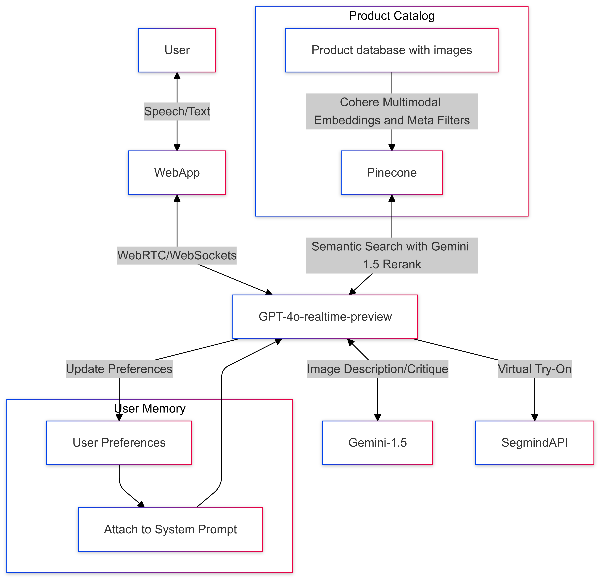

# Sushi Hackathon 2024 - Hackathon AI Shopping Concierge

## Team Name: American Sushi Indulgers & Connoisseurs (ASICs)

## Overview

Current e-commerce platforms lack personalization and guidance, resulting in suboptimal shopping experiences. Our solution is an AI-powered shopping concierge that emulates the experience of shopping in a high-end retail store. Our AI concierge allows users to express their desires conversationally, get personalized product recommendations, try-on products virtually, and receive styling advice. It also continuously learns from user interactions, improving its understanding of individual preferences over time.

Key benefits include enhanced user engagement, improved customer satisfaction, and increased sales conversion rates. For consumers, this means more efficient and enjoyable shopping. For merchants, it provides new avenues for customer interaction and data-driven insights.

By combining online convenience with personalized attention typically found in high-end retail, our solution aims to transform the e-commerce landscape, setting a new standard for online shopping experiences.

## Problem & Solution

### Problem
The traditional e-commerce shopping experience has become stagnant and commoditized. In every virtual storefront, consumers are made to follow the same routine: aimlessly browsing through vast product catalogs with little-to-no guidance, hoping to find a product that sparks their interest. Existing search functionalities lack the nuance of natural language, making it frustrating for users to articulate their specific needs. Static product images often fail to convey how items would look on individual users and their unique body types, leading to decision paralysis, poor sizing, and costly returns. The lack of user interaction hinders the ability of merchants to learn more about the user and provide thoughtful recommendations.

What's missing is a nuanced, interactive, and tailored experience that can match the personalized attention and expert guidance found in high-end brick-and-mortar retail stores.

### Solution
To address these key issues, we propose an AI-powered personal shopping concierge that integrates seamlessly into existing e-commerce platforms. This solution will leverage LLMs to create intuitive user interactions and experiences, allowing customers to easily express their needs and preferences. The AI concierge will learn from conversations with the user, enabling increasingly personalized product recommendations over time. It will also incorporate a generative AI-powered virtual try-on feature to help users visualize how products will look, address sizing concerns, and get fashion advice.

## Approach

### Workflow

1. **User Interaction**: The user visits the virtual storefront and interacts with the AI concierge via voice or text input.

2. **Speech Processing and Understanding**: The real-time speech model (gpt-4o-realtime-preview) processes the user's input and extracts user intent and any key entities.

3. **Product Search and Recommendation**: If the AI concierge determines that the user is looking for product recommendations, it will conduct hybrid (keyword + semantic) search within our vector database (Pinecone) to retrieve relevant products based on the user's input and any learned preferences from previous conversations.

4. **Virtual Try-On**: If the AI concierge detects a user's interest in a specific product, it will proactively offer a virtual try-on experience, allowing the user to visualize themselves wearing the item using either their device's camera or uploaded images (Segmind API).

5. **Styling Advice**: If the AI concierge determines that the user is looking for advice or feedback on their outfit, it will analyze the user's outfit using a visual understanding model (gpt-4o-mini) and provide personalized styling advice, as well as answer user questions.

6. **Preference Learning**: As the AI concierge interacts with the user, it will learn more about the user's preferences and keep track of them by storing them in the database to help with future interactions.

### Data Requirements

**Product Catalog**: A database of the products available for purchase. Specific information about each product that we need include:
- Product title
- Description
- Price
- Image
- Category
- Existing tags

### Key Technologies Leveraged

1. **Real-time Speech and Conversation**: gpt-4o-realtime-preview enables bidirectional, real-time speech and text communication between the user and the AI concierge. Function calling allows the model to interact with external systems for product search and virtual try-on.

2. **Image Understanding and Manipulation**: gpt-4o-mini provides image description and critique capabilities, allowing the AI to understand user-provided images and offer styling advice. Segmind's API powers the virtual try-on feature, generating realistic images of users wearing different products.

3. **Semantic Search and Product Catalog**: The product catalog is indexed in Pinecone, a hybrid semantic-search enabled vector database. gpt-4o-mini enriches product data with additional tags, enabling nuanced semantic search based on user queries and preferences.

4. **Personalized Recommendations**: User preferences learned during conversations are stored as natural language descriptions in "memory" and attached to the gpt-4o-realtime-preview system prompt, ensuring personalized recommendations across sessions.

5. **Web Application Development**: The user interface is built using React.js and Typescript, providing a responsive and engaging user experience.

### System Architecture


The system architecture consists of:
- User interaction with the web app
- Communication with the gpt-4o-realtime-preview model
- Integration with services like gpt-4o-mini for image understanding
- Segmind API for virtual try-on
- Pinecone for product search
- Storage and utilization of user preferences for experience personalization

# Getting Started
## Environment Setup
1. Create a virtual environment with Python 3.11.
2. Install Poetry if you haven't already.
```bash
pip install poetry
```
3. Run poetry install.
```bash
poetry install
```
4. Add a `.env` file similar to the .env.example with keys from the respective services in the root directory. (Get the .env from Yushi).
5. Start the chainlit app.
```bash
chainlit run app.py
```
